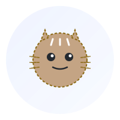

<div align="center">

  
  
  # 你好，我是 Yangwan

</div>
<div align="center">
  
### 代码改变世界，创新驱动未来
### Code Changes the World, Innovation Drives the Future
</div>


<table style="width:100%">
<tr>
<td style="width:50%" valign="top" align="left">

```c
#include <stdio.h>

int main() {
    printf("Hello World!\n");
    return 0;
}
```

</td>
<td style="width:50%" valign="middle" align="center">

<div align="center">


<br>


<br>


</div>

</td>
</tr>
</table>


## 关于我 | About Me

#### 个人信息 | Personal Info
- 🏙️ 坐标：深圳
- 💼 职业：后端开发工程师
- ⏰ 经验：2+ 年
- 🎯 当前学习：C 语言、底层技术、Java 进阶等
- 🐱 宠物：一只叫大福的独眼猫猫
- 💻 常用工具：IntelliJ IDEA、VS Code、Git
- ☕ 代码伴侣：咖啡 
- 📚 阅读偏好：技术博客、男性交友网站(github)等
- 🎮 放松方式：撸猫、写代码、运动(篮球，游泳等)、听歌、英雄联盟

我是在深圳工作的后端开发工程师，入行两年多，一直在和 Java、业务系统以及各种线上小事故打交道。  

日常的快乐来自于把一堆混乱的需求，整理成还能看得过去的代码和架构。最近在折腾 C 语言和底层相关的东西，也在慢慢补Java和基础设施方面的短板。  

如果非要用一句话形容自己，大概就是：还在路上，但真的在往前走。

在这条道路上经历过低谷，也见到一丝光芒。很幸运的是遇到了一群不错的家伙。有时候写代码更像是在和自己较劲：一边被 bug 折磨，一边又因为一个小小的优化开心半天。哈哈哈哈。  
不算那种天赋型选手，只是还愿意多试一次、多查一页文档、多重构一遍的人。

加油吧！！！


## 关于 logo

为什么使用小猫咪作为 logo？因为我家有一只非常可爱的独眼猫猫。

大福其实一直待在公司附近，非常粘人，每次路过都会过来蹭蹭。那时候我一直在考虑要不要领养他，可就是因为优柔寡断，一直拖着没做决定。结果某一天晚上，不知道被什么人用弹弓或者武器打伤了，一颗弹珠卡在了眼睛里，夺去了他的一只眼睛。

小家伙受伤后，我带他去医院做了手术，把弹珠取了出来。万幸的是，除了失去一只眼睛，其他都没什么大碍，恢复得也很好。

后来猫猫寄宿在我家之后，我为他正式取名叫作：**大福**。希望猫猫能有大福，大贵就交给我了。

虽然只有一只眼睛，但大福依然活泼可爱，每天在家里跑来跑去，用剩下的那只眼睛好奇地打量着这个世界。有时候写代码累了，看看他在旁边打盹的样子，心情就会好很多。

所以这个 logo，也算是为了纪念大福吧。一只坚强、可爱的小狸花猫。

也希望看到这里的你，如果遇到流浪的小动物，能善待它们。**如果不爱，请别伤害**。每一个生命都值得被尊重。


## 技术栈 | Tech Stack

在编程上，我认为自己不是一个天赋型选手。但仍对自己的技术栈保持怀疑和探索，不会因为熟悉某个技术就停止学习新的东西。这样我的头脑不会随着年龄而老化

### 前端技术栈 | Frontend

<div align="center">


</div>

### 后端技术栈 | Backend

<div align="center">


</div>

---

## 项目 | Projects

| 项目 | 技术栈 | 链接 |
|:----|:------|:-----|
| **LoadBalancer**<br>使用 C 语言实现的负载均衡器 | `C` `Lua` `Docker` | [](https://github.com/yangwan-cw/loadBalancer) |

---

## 个人博客 | Blog

博客是我在 **2025** 年启动的一个项目分支。为什么去维护博客？其实也没那么多大道理，就是想把踩过的坑、学到的东西记录下来。一方面是给自己留个笔记，免得以后遇到同样的问题又要重新查一遍；另一方面，如果恰好能帮到路过的人，那就更好了。

不过,理想很丰富，现实很骨感。我又能坚持多久呢？

<div align="center">

[](http://111.228.6.56/)

</div>

## 飞书文档


---

## 贡献热力图 | Contribution Graph

<div align="center">
  
[](https://github.com/yangwan-cw)

</div>

---

## 联系我 | Contact Me

<div align="center">

[](mailto:a2572213252@gmail.com)

</div>

---

