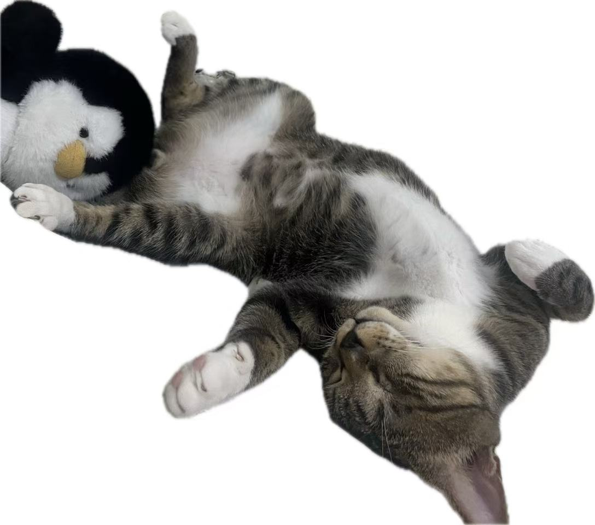
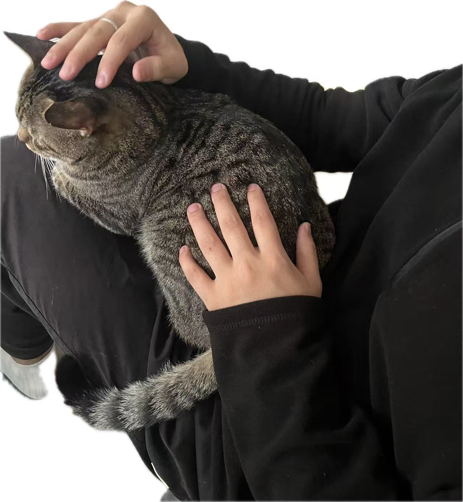

<div align="right">

[English](README_EN.md) | [中文](README.md)

</div>

<div align="center">

  
  
  # Hello, I'm Yangwan

</div>
<div align="center">
  
### Code Changes the World, Innovation Drives the Future
### Code Changes the World, Innovation Drives the Future
</div>


<table style="width:100%">
<tr>
<td style="width:50%" valign="top" align="left">

```c
#include <stdio.h>

int main() {
    printf("Hello World!\n");
    return 0;
}
```

</td>
<td style="width:50%" valign="top" align="center">

<div align="center">


<br>


<br>


</div>

</td>
</tr>
</table>

<div align="center">


</div>

## About Me

#### Personal Info
- 🏙️ Location: Shenzhen
- 💼 Profession: Backend Developer
- ⏰ Experience: 2+ years
- 🎯 Currently Learning: C Language, Low-level Technology, Java Advanced, etc.
- 🐱 Pet: A one-eyed cat named Dafu
- 💻 Common Tools: IntelliJ IDEA, VS Code, Git, Claude, Cursor
- ☕ Coding Companions: Coffee, Feishu, Music, Yuque
- 📚 Reading Preferences: Tech Blogs, GitHub (the male social network), etc.
- 🎮 Ways to Relax: Petting cats, coding, sports (basketball, swimming, etc.), listening to music, League of Legends

I'm a backend developer working in Shenzhen, with over two years of experience dealing with Java, business systems, and various online incidents.

The daily joy comes from organizing messy requirements into somewhat decent code and architecture. Recently, I've been working on C language and low-level related stuff, and slowly filling gaps in Java and infrastructure.

If I had to describe myself in one sentence, it would be: Still on the road, but really moving forward.

I've experienced lows on this path and also seen a glimmer of light. I'm fortunate to have met a great group of people. Sometimes coding feels like wrestling with myself: being tormented by bugs while getting excited about a small optimization. Hahaha.  
I'm not the talented type, just someone who's willing to try one more time, check one more page of documentation, and refactor one more time.

I don't know if I'll stay on this path forever, but I'll do my best in the present and enjoy life.


## About Logo

Why use a kitten as the logo? Because I have a very cute one-eyed cat at home.

<div align="center">

<table>
<tr>
<td align="center">



</td>
<td align="center">



</td>
</tr>
</table>

</div>

Dafu used to stay near the company, very clingy, and would come over to rub against me every time I passed by. I was considering whether to adopt him, but because of my indecisiveness, I kept putting off the decision. Then one night, someone injured him with a slingshot or weapon, and a pellet got stuck in his eye, taking away one of his eyes.

After the little guy was injured, I took him to the hospital for surgery to remove the pellet. Fortunately, except for losing one eye, everything else was fine, and he recovered well.

After the cat stayed at my home, I officially named him **Dafu**. I hope the cat will have great fortune (Dafu), and I'll handle the great wealth (Dagui).

Although he only has one eye, Dafu is still lively and cute, running around the house every day, curiously observing the world with his remaining eye. Sometimes when I'm tired from coding, seeing him dozing nearby makes me feel much better.

So this logo is also a tribute to Dafu. A strong, cute tabby cat.

I also hope that if you encounter stray animals, you can treat them kindly. **If you don't love them, please don't hurt them**. Every life deserves respect.


## Tech Stack

In programming, I don't consider myself a naturally talented person. But I still maintain skepticism and exploration of my tech stack, and won't stop learning new things just because I'm familiar with a technology. This way, my mind won't age with time.

### Frontend

<div align="left">


</div>

### Backend

<div align="left">


</div>


## About AI

AI technology is profoundly changing the way programmers work. As a developer, I think it's necessary to organize my understanding and principles for using AI tools, maintain a clear awareness, embrace new technologies while avoiding the trap of over-dependence.


AI is a double-edged sword. It can help us solve problems quickly, learn new knowledge, write boilerplate code, and debug errors. Claude Code and Cursor Agent have become part of my daily development, and they excel at handling repetitive work, rapid prototyping, code completion, and more.

But AI is not perfect. Its biggest problem is that it can produce "hallucinations"—generating seemingly reasonable but actually incorrect information. This kind of error is often very subtle, especially in unfamiliar technical fields, making it easy to be misled. The deeper risk is that if we over-rely on AI, we may gradually lose the ability to think independently and learn deeply, ultimately affecting our technical growth.

Based on these understandings, I always maintain a conservative and cautious attitude toward AI tools. This is not about rejecting new technology, but rather rationally viewing its position—AI is a tool, not a replacement.


## Projects

| Project | Tech Stack | Link |
|:----|:------|:-----|
| **LoadBalancer**<br>A load balancer implemented in C | `C` `Lua` `Docker` | [](https://github.com/yangwan-cw/loadBalancer) |

## Blog

The blog is a project branch I started in **2025**. Why maintain a blog? There's not much philosophy behind it—I just want to record the pitfalls I've encountered and the things I've learned. On one hand, it's a note for myself so I don't have to look things up again when I encounter the same problems; on the other hand, if it happens to help someone passing by, that's even better.

However, ideals are rich, but reality is harsh. How long can I persist?

<div align="left">

[](http://111.228.6.56/)

</div>

## External Docs

> **Coming Soon** - Content is being organized...

<div align="left">


</div>


## Contribution Graph

<div align="center">
  
[](https://github.com/yangwan-cw)

</div>

## Contact Me

<div align="left">

[](mailto:a2572213252@gmail.com)

</div>

